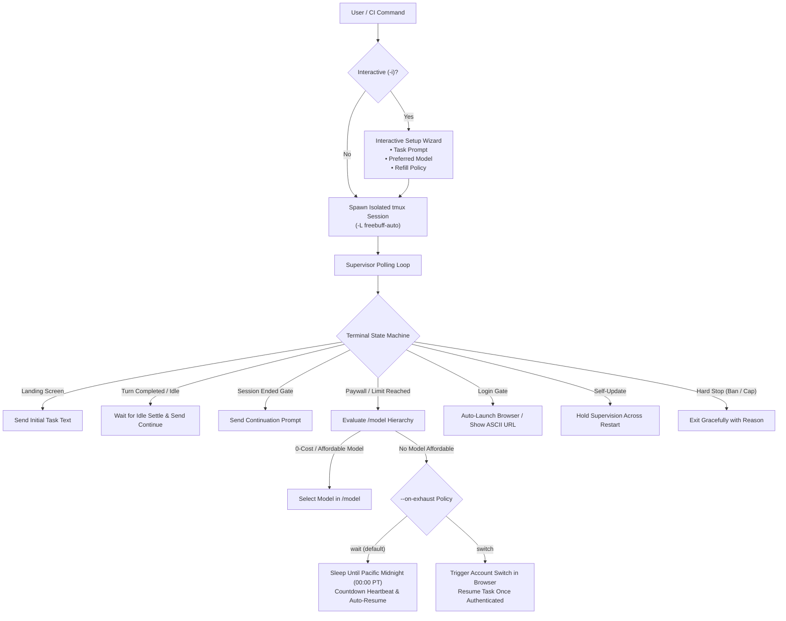

# freebuff-autocontinue

[](https://www.npmjs.com/package/freebuff-autocontinue)
[](https://opensource.org/licenses/MIT)
[-brightgreen.svg?style=flat-square)](./package.json)
[-lightgrey.svg?style=flat-square)](#platform-compatibility)
[](./.github/workflows/ci.yml)
[-blueviolet.svg?style=flat-square)](#is-this-secure)

> **Autonomous session supervisor for the [Freebuff CLI](https://freebuff.com/cli) AI coding agent.**  
> Runs inside a detached, isolated `tmux` session with smart model fallback, Pacific Midnight refill scheduling, graceful midway account switching, and zero external runtime dependencies.

---

## ⚡ Quickstart (Choose Your Preferred Method)

### Option 1: Instant Run via `npx` (No Install Needed)
Run directly from your terminal in any project directory:
```bash
npx freebuff-autocontinue
```
With custom task prompt:
```bash
npx freebuff-autocontinue --text "continue tests, push to main and verify @.scratch/PROGRESS.md"
```

### Option 2: Homebrew (`brew`)
```bash
brew tap kelvindesman/freebuff-autocontinue https://github.com/kelvindesman/freebuff-autocontinue
brew install freebuff-autocontinue
```

### Option 3: One-Line Installer (`curl | bash`)
Installs the standalone native binary to `~/.local/bin` (no Node.js or Python required on host!):
```bash
curl -fsSL https://raw.githubusercontent.com/kelvindesman/freebuff-autocontinue/main/install.sh | bash
```

### Option 4: Global npm
```bash
npm install -g freebuff-autocontinue
freebuff-autocontinue
```

---

## 🧭 Architecture & How It Works

`freebuff-autocontinue` spawns the `freebuff` CLI inside a dedicated, isolated `tmux` session (`-L freebuff-auto`). A real terminal emulator answers ANSI cursor queries, window resizes, and keystroke events reliably—preventing swallowed Enter keys and truncated redraws.



---

## ✨ Key Features

### 1. Smart Model Fallback (DeepSeek V4.1 Flash Priority)
Freebuff includes leading models with varying Freebucks costs. By default, `freebuff-autocontinue` prioritizes **DeepSeek V4.1 Flash** (fast, unmetered coding tier in the official catalog).
- Override anytime:
  ```bash
  freebuff-autocontinue --model deepseek
  freebuff-autocontinue --model "0-cost"      # Auto-select 0 Freebucks/hr tier
  freebuff-autocontinue --model cheapest    # Auto-select lowest priced tier
  ```
- If a quota paywall hits, the supervisor automatically evaluates `/model`, picks the best affordable fallback, and confirms model switching without stopping your work.

### 2. Pacific Midnight Refill Scheduler (`--wait-refill`)
Freebuff refills free Freebucks daily at **Midnight Pacific Time (00:00 PT / America/Los_Angeles)**.
- When daily credits are exhausted and no model can run, the CLI calculates the exact countdown until Pacific Midnight (+ 60s buffer):
  ```text
  [autocontinue] Freebucks exhausted. Waiting until Pacific Midnight (2026-10-04 00:01:00 PDT, in 7h 24m) for daily refill...
  [autocontinue] [refill-wait] 6h 59m remaining until Pacific Midnight refill...
  ```
- Automatically wakes up and resumes the session once credits refill!
- Toggleable via `--wait-refill` (default: true) or `--no-wait-refill`.

### 3. Graceful Midway Account Switching (`--on-exhaust switch`)
Need to keep working immediately without waiting for midnight?
- Run with `--on-exhaust switch` or select **[S] Switch Account** when prompted.
- The supervisor triggers a clean `/logout`, pops open your browser to the Freebuff authentication URL, and displays a prominent ASCII box:
  ```text
  ┌─────────────────────────────────────────────────────────────────────────────┐
  │ SWITCHING FREEBUFF ACCOUNT                                                  │
  ├─────────────────────────────────────────────────────────────────────────────┤
  │ 1. Complete authentication in your browser (Google, GitHub, or Apple).     │
  │ 2. Solve the Cloudflare Turnstile verification.                             │
  │ 3. If your browser did not open automatically, visit this URL:              │
  │    👉 https://freebuff.com/login?code=...                                   │
  │                                                                             │
  │ ⏳ The watcher is paused waiting for login to complete, then auto-resumes! │
  └─────────────────────────────────────────────────────────────────────────────┘
  ```
- Click "Continue with Google" or "Continue with GitHub" in your browser. As soon as authentication completes, the watcher detects the active session and **seamlessly resumes your task right where it left off**!

### 4. First-Time & Expired Session Login Handling
- Automatically detects `Press ENTER to login` or `Sign in to continue`.
- Launches your default system browser (`open` on macOS, `xdg-open` on Linux, `start` on Windows).
- Provides a clickable ASCII URL box for headless or remote SSH servers.
- Pauses until browser authentication succeeds, then proceeds with the task.

### 5. Self-Update Resiliency
- Freebuff periodically self-updates (`Update available: ... → ...`, `Download complete! Starting freebuff...`).
- `freebuff-autocontinue` detects self-update noise, holds watcher state across restarts, and never sends premature keystrokes.

### 6. Interactive Setup Wizard (`-i`) vs. Quick Mode
- **Quick Mode (Default)**: Runs immediately with CLI arguments or defaults (`npx freebuff-autocontinue`).
- **Interactive Mode (`-i` / `--interactive`)**: Built-in wizard (using native Node.js `readline/promises`, 0 dependencies) prompting for task text, preferred model, refill policy, and max continues before launching.

### 7. Instant Terminal Attachment (`--attach`)
Hop directly into the running tmux session at any time:
```bash
freebuff-autocontinue --attach
```
*(Detach anytime with `Ctrl+B, d` without interrupting the supervisor).*

---

## 🔒 Is This Secure?

**Yes.** `freebuff-autocontinue` adheres to rigorous open-source security standards:

1. **Zero Runtime Dependencies**: The package specifies `"dependencies": {}`. No third-party npm libraries are downloaded or executed at runtime, eliminating supply-chain attack vectors.
2. **Dedicated Socket Isolation**: Runs in `tmux -L freebuff-auto`, completely isolated from your personal tmux sessions.
3. **No Shell Injection**: Subprocesses are spawned using discrete argument arrays (`child_process.spawnSync("tmux", ["-L", ...])`). Never passes strings to `/bin/sh`.
4. **100% Local & No Telemetry**: Absolutely no data, prompts, or credentials are sent over any external network.
5. **Ethical Compliance**: Fully complies with [freebuff.com](https://freebuff.com) and [freebuff.com/web](https://freebuff.com/web) terms. Halts on bans (`banned`), country blocks (`country-blocked`), or IP caps (`ip-capped`).

For more details, see [SECURITY.md](./SECURITY.md).

---

## ⚙️ CLI Options Reference

| Option | Type | Default | Description |
| :--- | :--- | :--- | :--- |
| `-t, --text <text>` | `string` | *(default task)* | Resume task text sent to Freebuff |
| `--text-file <path>` | `string` | `undefined` | Read resume task text from a file |
| `-m, --model <name>` | `string` | `DeepSeek V4.1 Flash` | Preferred model (e.g. `deepseek`, `0-cost`, `cheapest`) |
| `-i, --interactive` | `boolean` | `false` | Launch interactive terminal setup wizard |
| `--on-exhaust <action>` | `string` | `wait` | Policy on credit exhaustion: `wait` \| `switch` \| `stop` |
| `--wait-refill` | `boolean` | `true` | Wait for Pacific Midnight refill if credits run out |
| `--no-wait-refill` | `boolean` | `false` | Exit immediately if credits run out |
| `--cmd <command>` | `string` | `freebuff` | CLI command to execute inside tmux |
| `--cwd <path>` | `string` | `process.cwd()` | Working directory for the CLI |
| `--session <name>` | `string` | `fb-auto` | tmux session name |
| `--max-continues <n>` | `number` | `10` | Maximum auto-sends per run |
| `--max-restarts <n>` | `number` | `3` | Maximum relaunches if session exits |
| `--cooldown <sec>` | `number` | `45` | Minimum seconds between auto-sends |
| `--poll <sec>` | `number` | `3` | Seconds between screen polls |
| `--heartbeat <sec>` | `number` | `15` | Seconds between live progress heartbeat updates |
| `--idle-settle <sec>` | `number` | `6.0` | Seconds composer must be idle before auto-continuing |
| `--stall-timeout <sec>`| `number` | `900` (15m) | Seconds without screen changes before stall warning |
| `--settle <sec>` | `number` | `2.0` | Seconds between typing text and pressing Enter |
| `--enter-key <key>` | `string` | `Enter` | tmux key name sent as Enter |
| `--log-file <path>` | `string` | `freebuff-autocontinue.log` | Path for timestamped screen snapshots |
| `--resume` | `boolean` | `true` | Attach watcher to existing session if found |
| `--no-resume` | `boolean` | `false` | Disallow attaching to existing session |
| `--kill-on-exit` | `boolean` | `false` | Kill tmux session on exit (default leaves running) |
| `--allow-risky` | `boolean` | `false` | Consider TEST/peak-window tiers in model fallback |
| `--no-banner` | `boolean` | `false` | Silence rotating community reminders |
| `--attach` | `boolean` | `false` | Attach directly to the tmux session |
| `--self-test` | `boolean` | `false` | Run internal pattern detection tests |
| `--dry-run` | `boolean` | `false` | Classify sample transcript and preview actions |
| `-v, --version` | `boolean` | `false` | Show version |
| `-h, --help` | `boolean` | `false` | Show help message |

---

## 💻 Platform Compatibility

- **macOS**: Native support on Apple Silicon (`arm64`) and Intel (`x64`). Requires `tmux` (`brew install tmux`).
- **Linux**: Native support on Ubuntu, Debian, Fedora, Arch (`x64` and `arm64`). Requires `tmux` (`sudo apt-get install tmux`).
- **Windows**: Fully supported via **WSL2** (Ubuntu recommended: `wsl --install && sudo apt install tmux`) or **Git Bash / MSYS2** with `tmux`.

---

## 📜 Legal, Terms & Privacy Disclaimer

1. **Non-Affiliation**: `freebuff-autocontinue` is an independent, open-source automation utility developed by Kelvin and contributors. It is not affiliated with, maintained by, or endorsed by CodebuffAI, Freebuff, or their affiliates.
2. **Adherence to Freebuff Terms**: Users of this utility must comply with all Terms of Service, Acceptable Use Policies, and guidelines published at [https://freebuff.com](https://freebuff.com) and [https://freebuff.com/web](https://freebuff.com/web).
3. **No Circumvention**: This utility **never** bypasses paywalls, token limits, account bans, or security controls. It strictly acts as an automated keyboard/screen supervisor for the standard Freebuff CLI terminal interface.
4. **User Responsibility**: Users remain solely responsible for the prompts sent, model costs incurred against their account or wallet, and their account standing.
5. **Zero Data Collection**: No user code, repository data, prompts, or credentials are ever transmitted to the creators of `freebuff-autocontinue`.

---

## ☕ Support, Community & Maintainers

If `freebuff-autocontinue` saves you time and keeps your autonomous coding agent productive, please consider supporting the project:

- ☕ **Buy Me a Coffee**: [buymeacoffee.com/kelvindsmn](https://buymeacoffee.com/kelvindsmn)
- ⭐ **Star the Project**: Give us a star on [GitHub](https://github.com/kelvindesman/freebuff-autocontinue)
- 💼 **Paid Ads, Sponsorships or Collab**: DM `@kelvindsmn` or open an inquiry
- 💬 **Discord Community**: Join fellow developers and maintainers on [Discord](https://discord.gg/cR5PgByzw)

---

## 📄 License

Distributed under the [MIT License](./LICENSE). Copyright (c) 2026 Kelvin & Contributors.
